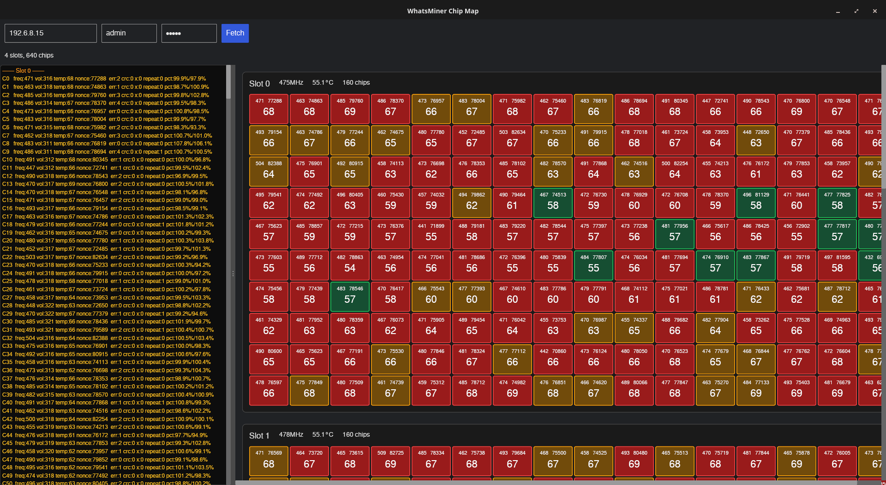

# WhatsMiner Chip Map GUI

> Chip Map of Miner API Log

## Demo



## Analysis Modes

### Gradient (local hotspots)

- Highlights chips **hotter** than their upstream neighbors
- Airflow-aware with snake pattern support:
  ```
  Top section:    [D3][D4][D5]  ← D5 at intake (upstream = higher domain)
  Bottom section: [D2][D1][D0]  ← D0 at intake (upstream = lower domain)
  ```
- Being hotter than downstream (toward exhaust) is expected and ignored
- Cold spots are ignored (green = no problem)
- Range: 0-15°C above upstream neighbors → green to red

### Outliers (cross-slot comparison)

- Compares each chip position across **all slots/hashboards**
- Example: C45 on slot 0 vs C45 on slot 1 vs C45 on slot 2
- Only flags chips **hotter** than the same position on other boards
- If all boards have similar temps at position X, but one is higher → red flag
- Range: 0-3 standard deviations → green to red

### Nonce (performance detection)

- Detects **underperforming** chips based on nonce count
- Computes average nonce count per slot, then flags chips below average
- Dead or failing chips show up red (0 nonces = 100% deficit)
- Overperforming chips are ignored (green = no problem)
- Range: 0-50% below slot average → green to red
